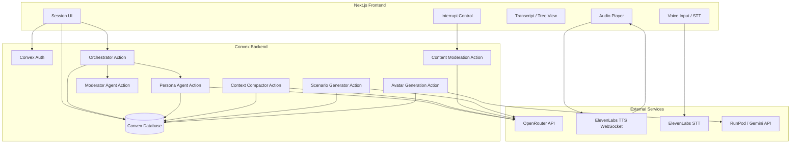
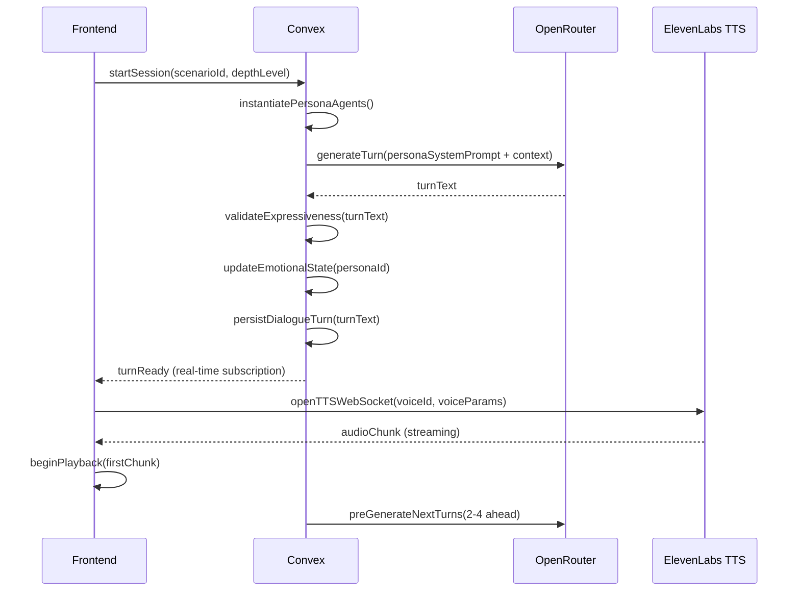
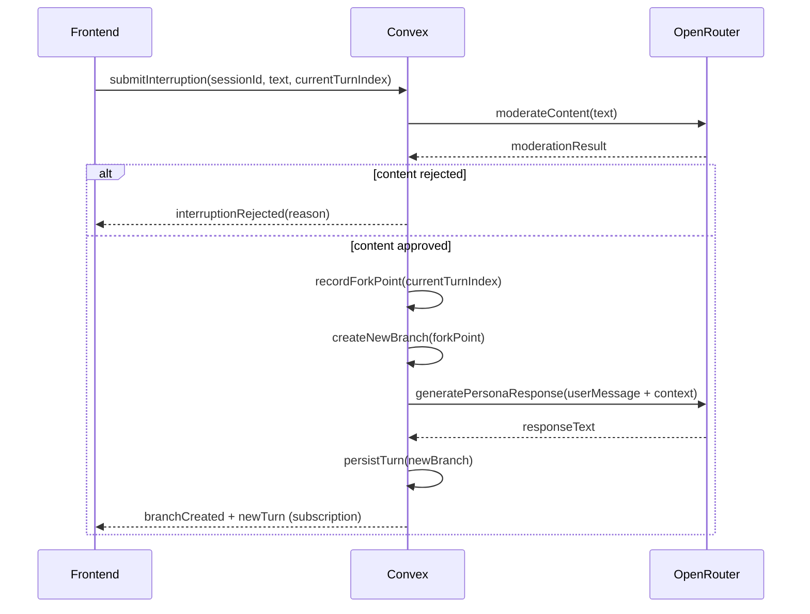

# Design Document: POV Podcast

## Overview

POV Podcast is an AI-powered interactive podcast platform that recreates major historical events through multi-perspective conversations. Users browse or generate historical scenarios, then listen to (and optionally interrupt) a branching dialogue between distinct AI persona agents — each with its own voice, emotional state, and ideological position.

The system is composed of four primary layers:

1. **Next.js frontend** — UI, audio playback, transcript, conversation tree visualisation
2. **Convex backend** — data storage, auth (Convex Auth), agent orchestration, business logic
3. **External AI services** — OpenRouter (LLM text generation), ElevenLabs (TTS/STT), RunPod/Gemini (avatar generation)
4. **Content pipeline** — scenario seeding, persona generation, context compaction, moderation

### Key Design Decisions

- **Convex as the orchestrator**: All agent coordination, turn sequencing, emotional state updates, and context compaction run as Convex actions/mutations. This keeps state consistent and avoids distributed coordination complexity.
- **OpenRouter for all LLM calls**: A single OpenAI-compatible endpoint with a hardcoded model. Swapping models requires only an environment variable change, not code changes.
- **ElevenLabs WebSocket TTS**: The `eleven_flash_v2_5` model over WebSocket delivers audio chunks as they are synthesised, enabling sub-2-second first-chunk playback.
- **Convex real-time subscriptions**: The frontend subscribes to Convex queries; all state changes (new turns, emotional state updates, branch navigation) propagate automatically without polling.
- **Branching stored as a tree in Convex**: Each dialogue turn records its `branchId` and `parentTurnIndex`, enabling full tree reconstruction and branch navigation without duplicating shared history.

---

## Architecture



### Request Flow: Dialogue Turn Generation



### Request Flow: User Interruption



---

## UI Layout and Interaction Design

### Home Page Layout

The home page is divided into two sections, inspired by the Twitter/X Spaces discovery feed:

**"Historical Scenarios" section** — displays the 12 pre-built scenarios as cards in a responsive grid. Each card shows:
- Era badge (e.g. "Modern", "Contemporary") in the top-left corner
- Scenario title (bold, prominent)
- Time period subtitle
- Short description (≤200 chars)
- A row of up to 6 small circular persona avatar thumbnails at the bottom of the card

**"Your Scenarios" section** — displays user-generated scenarios in the same card format, with a prominent "Create New Scenario" button at the top of this section. If the user has no custom scenarios yet, a large empty-state CTA is shown instead.

Era filter chips (All / Modern / Contemporary) sit above both sections and filter the pre-built grid in real time.

---

### Scenario Creation Flow

A multi-step flow triggered by "Create New Scenario":

1. **Topic input step** — single text field (3–500 chars) with character counter and validation. "Generate" button submits to the Convex `generateScenario` action.
2. **Generation progress step** — animated loading screen showing personas being created one by one, each appearing with their avatar and role label as they are generated.
3. **Persona review step** — the `PersonaEditor` component (see below). User can edit, delete, or add personas before confirming. "Start Session" button navigates to `SessionSetup`.

This same persona review/edit step is accessible from any existing scenario's detail page via an "Edit Personas" button.

---

### Session Player Layout (Twitter Spaces-inspired)

The session player is a full-screen experience modelled on the Twitter/X Spaces UI:

```
┌─────────────────────────────────────────┐
│  ← Back   [Scenario Title]   ··· Leave  │  ← Header bar
│  ● REC                                  │
├─────────────────────────────────────────┤
│                                         │
│           ┌──────────────┐              │
│           │  [LARGE DP]  │  ← Stage     │  Currently speaking persona
│           │  ~~~~~~~~~~~~│    area      │  Large avatar (~120px) with
│           └──────────────┘              │  animated colored ring
│         Persona Name · Role             │
│         😤 Frustrated                   │  Emotional state badge
│                                         │
│  ─────────────────────────────────────  │
│                                         │
│  [dp] [dp] [dp] [dp]  ← Persona grid   │  All other personas as
│  Name  Name  Name  Name                 │  smaller avatars (~64px)
│  Role  Role  Role  Role                 │  in a 4-column grid
│                                         │
│  [dp] [dp] [dp] [dp]                   │
│  Name  Name  Name  [You]               │  User's own avatar in grid
│                                         │
├─────────────────────────────────────────┤
│  🎙️ Request  👥  🔗  💬 73             │  ← Controls bar
└─────────────────────────────────────────┘
```

**Stage area (top center):**
- The currently speaking persona's avatar is displayed large (~120px diameter) with an animated pulsing colored ring
- Persona name, historical role, and emotional state badge (mood label + icon) shown below the avatar
- When no persona is speaking (paused), the last speaker's avatar remains in the stage at reduced opacity

**Participants grid (below stage):**
- All other personas displayed as smaller circular avatars (~64px) in a responsive 4-column grid
- Each avatar has a thin colored ring that activates (animates) when that persona is speaking
- The user's own avatar appears in the grid labelled "You"
- Tapping a persona avatar in the grid shows a popover with their name, role, and a "Force speak next" option

**Controls bar (bottom, fixed):**
- **Push-to-talk (PTT) microphone button** — left-most, prominent. Hold to speak; releases to submit voice input via ElevenLabs STT. Shows a recording pulse animation while held.
- **Participants button** — opens the participants list sheet (personas grouped by role, similar to the Spaces guests list)
- **Share/settings button** — opens session settings (turn-taking mode, depth level)
- **Transcript/chat button** — opens the unified transcript panel, shows unread message count badge

---

### Transcript / Chat Panel

Slides up as a bottom sheet (or side drawer on desktop) over the session player. Unified view combining all dialogue turns and user messages:

```
┌─────────────────────────────────────────┐
│  Transcript                          ✕  │
├─────────────────────────────────────────┤
│  [dp] Field Nurse · 2m ago              │
│       "I've seen things no one should   │
│        ever have to see..."             │
│        📎 BBC Archives — WWII Nurses    │  ← inline citation chip
│                                         │
│  [dp] War Correspondent · 1m ago        │
│       "The public deserves to know      │
│        the full truth of what..."       │
│                                         │
│  ── Branch fork ──────────────────────  │  ← fork point divider
│                                         │
│  [you] You · just now                   │
│        "What did the soldiers think     │
│         about the journalists?"         │
│                                         │
│  [dp] Front-line Soldier · just now     │
│       "We had mixed feelings. Some      │
│        of us wanted the world to..."    │
├─────────────────────────────────────────┤
│  [Type a message...]          🎙️  Send  │  ← input bar
└─────────────────────────────────────────┘
```

Each message entry shows:
- Circular avatar thumbnail (left)
- Speaker name + role label + timestamp
- Message text
- Inline citation chips (tappable, open source URL in new tab) where applicable
- Branch fork dividers where the conversation tree branched

The input bar at the bottom allows typed text (1–1000 chars) or voice input (PTT mic button). Submitting creates an interruption and forks the dialogue.

---

### Persona Editor Component

Available during scenario creation and when editing any existing scenario. Displays each persona as a card:

```
┌──────────────────────────────────────┐
│  [Avatar]  Field Nurse               │
│            Woman on the Home Front   │
│            "Compassionate, resilient │
│             and deeply traumatised"  │
│                          [Edit] [✕]  │
└──────────────────────────────────────┘
```

- Tapping "Edit" opens an inline expansion with editable fields: name, historical role, personality traits, emotional backstory, speaking style, ideological position, and system prompt preview
- "✕" deletes the persona (with confirmation if session has started)
- "Add Persona" button at the bottom creates a blank card (max 6 personas enforced with a warning)
- Avatar shows a loading spinner while generation is in progress; falls back to initials if generation fails

---

## Components and Interfaces

### Frontend Components

#### `HomePage`
Two-section layout: "Historical Scenarios" grid (12 pre-built cards) and "Your Scenarios" grid (user-generated). Era filter chips above the pre-built grid. "Create New Scenario" CTA button at the top of the custom scenarios section. Navigates to `ScenarioGenerator` on CTA click, or to `SessionSetup` on card click (within 500ms).

#### `ScenarioCard`
Reusable card component. Displays era badge, scenario title, time period, description (≤200 chars), and a row of up to 6 small circular persona avatar thumbnails. Used on `HomePage` and in search/filter results.

#### `ScenarioGenerator`
Multi-step form: topic input → generation progress → `PersonaEditor` review. Submits to `generateScenario` Convex action. Shows per-persona generation progress. On completion, navigates to `SessionSetup`.

#### `PersonaEditor`
Persona management component used during scenario creation and when editing existing scenarios. Each persona rendered as an expandable card with avatar, name, role, personality summary, and system prompt. Supports edit, delete, and add actions. Enforces 6-persona maximum.

#### `SessionSetup`
Pre-session configuration screen: depth level picker (Casual / Intermediate / Scholar), optional Calibration Persona flow, turn-taking mode selector (Relevance / Round Robin / Random). "Start Session" calls `startSession` mutation.

#### `SessionPlayer`
Full-screen Twitter Spaces-style session UI. Composed of:
- `StageArea` — large avatar of the currently speaking persona with animated colored ring, name, role, and emotional state badge
- `PersonaGrid` — responsive 4-column grid of all other persona avatars (smaller, ~64px) with per-avatar speaking ring activation; includes the user's own avatar
- `ControlsBar` — fixed bottom bar with PTT mic button, participants button, settings button, and transcript/chat toggle with unread badge
- `TranscriptPanel` — bottom-sheet unified transcript + chat with per-message avatar, name, timestamp, text, and inline citation chips; branch fork dividers; text + PTT input bar
- `ParticipantsSheet` — bottom sheet listing all personas grouped by role (analogous to Spaces "Guests" list), with force-next-speaker action per persona
- `SessionSettingsSheet` — turn-taking mode selector, depth level switcher, moderator trigger, conversation tree navigator, source map, relationship map

#### `SessionHistory`
List of past sessions ordered by most recent activity. Each row: scenario title, last-activity date, session status badge. Clicking restores the session.

#### `AuthForms`
Registration, login, forgot-password, and reset-password forms backed by Convex Auth.

### Convex Backend Functions

#### Queries (real-time subscriptions)
- `getScenarios(filter?)` — returns scenario list, optionally filtered by era
- `getSession(sessionId)` — full session state including current branch
- `getDialogueTurns(sessionId, branchId)` — turns on a specific branch
- `getConversationTree(sessionId)` — all branches and fork points
- `getPersonaStates(sessionId)` — current emotional state per persona
- `getUserSessions()` — session history list for the authenticated user; `userId` derived from `ctx.auth`
- `getUserPreferences()` — returns the authenticated user's `userPreferences` record; `userId` derived from `ctx.auth`

#### Mutations
- `startSession(scenarioId, depthLevel, turnTakingMode)` — creates session record, instantiates persona agent records; `userId` is derived from the authenticated Convex context via `ctx.auth` and is not passed as an argument
- `pauseSession(sessionId)` / `resumeSession(sessionId)`
- `endSession(sessionId)` — marks completed, blocks further turns
- `switchTurnTakingMode(sessionId, mode)`
- `updateDepthLevel(sessionId, depthLevel)` — changes depth level mid-session (Casual / Intermediate / Scholar); applied to all subsequent generated turns (Req 19.3)
- `forceNextSpeaker(sessionId, personaId)`
- `triggerModerator(sessionId, branchId)` — records user intent to invoke the Moderator, then schedules the `generateModeratorTurn` action (Req 17.4)
- `navigateToBranch(sessionId, branchId)`
- `submitInterruption(sessionId, text, turnIndex)` — single entry point for user interruptions; orchestrates content moderation → fork point recording → branch creation → persona response generation (Req 5.4–5.7)
- `persistDialogueTurn(sessionId, branchId, turn)` — called internally by orchestrator action
- `updateEmotionalState(sessionId, personaId, newState)`
- `createBranch(sessionId, forkPointTurnIndex)` — returns new branchId
- `pruneBranch(sessionId, branchId)` — deletes branch and all associated turns, audio URLs, and emotional state snapshots
- `persistCompactionSummary(personaAgentId, summary)`
- `updatePersona(personaId, fields)` — updates any subset of persona fields (name, historicalRole, personalityTraits, emotionalBackstory, speakingStyle, ideologicalPosition, voiceId); used by `PersonaEditor` (Req 2, UI)
- `deletePersona(personaId)` — removes a persona from a scenario; enforces minimum of 2 personas remaining (Req 2.2)
- `addPersona(scenarioId, personaData)` — adds a new persona to an existing scenario; enforces maximum of 6 personas (Req 2.7)
- `deleteScenario(scenarioId)` — deletes a user-generated scenario and all associated personas, sessions, and data; only permitted on scenarios where `isPrebuilt = false`
- `updateUserDefaultDepthLevel(depthLevel)` — persists the user's preferred depth level to `userPreferences`; applied as default when starting future sessions (Req 19.5); `userId` derived from `ctx.auth`
- `deleteUserAccount(userId)` — schedules permanent removal of all associated sessions, scenarios, and personal data within 30 days

#### Actions (side-effectful, can call external APIs)
- `generateScenario(topic)` — calls OpenRouter, persists scenario + personas, triggers avatar generation; `userId` derived from `ctx.auth`
- `orchestrateTurn(sessionId)` — selects next speaker, calls `generatePersonaTurn`, updates state
- `generatePersonaTurn(sessionId, personaId, branchId)` — builds context window, calls OpenRouter, validates expressiveness, persists turn
- `generateModeratorTurn(sessionId, branchId)` — generates moderator intervention turn via OpenRouter, persists turn
- `compactPersonaContext(sessionId, personaId)` — summarises 20 messages via OpenRouter
- `moderateInterruption(sessionId, text)` — content moderation check via OpenRouter; called internally by `submitInterruption`
- `generateAvatars(personaId)` — calls RunPod/Gemini, stores image URLs
- `validateArticleUrl(url)` — HEAD request to check URL reachability

#### Scheduled Functions
- `autoPruneBranches(sessionId)` — fires when a session transitions to `paused` or `completed` status; identifies all branches where `lastNavigatedAt` is null (never navigated) and calls `pruneBranch` for each; implements Req 16.6 branch pruning trigger

### ElevenLabs Voice Engine (Frontend Service)

A client-side TypeScript service (`VoiceEngine`) manages TTS WebSocket connections:

```typescript
interface VoiceEngine {
  openStream(voiceId: string, voiceParams: VoiceParams): TTSStream;
  sendText(stream: TTSStream, text: string): void;
  closeStream(stream: TTSStream): void;
  transcribeSpeech(audioBlob: Blob): Promise<string>; // STT
}

interface VoiceParams {
  stability: number;        // 0.0–1.0, lower = more expressive
  similarity_boost: number; // 0.0–1.0
  style: number;            // 0.0–1.0
  model_id: "eleven_flash_v2_5";
}
```

Voice parameters are derived from the persona's emotional state:
- `calm` → stability: 0.75, style: 0.2
- `frustrated` → stability: 0.35, style: 0.8
- `passionate` → stability: 0.45, style: 0.75
- `defensive` → stability: 0.55, style: 0.6
- `resigned` → stability: 0.80, style: 0.1

### Orchestrator Logic

The orchestrator runs as a Convex action triggered after each turn completes. It:

1. Reads all persona emotional states and the last N turns
2. Applies the active turn-taking mode:
   - **Relevance**: scores each persona by (emotional_relevance × 0.4 + relationship_factor × 0.3 + ideological_tension × 0.3), selects highest scorer, excludes last speaker
   - **Round Robin**: advances a fixed index pointer, wraps around
   - **Random**: random draw excluding last speaker
3. Checks for deadlock (same positions restated ≥3 consecutive turns)
4. If deadlock detected: triggers moderator turn instead
5. Calls `generatePersonaTurn` for the selected persona
6. Pre-generates 2–4 turns ahead in parallel (text only, not TTS)

---

## Data Models

### `scenarios` table

```typescript
{
  _id: Id<"scenarios">,
  title: string,
  timePeriod: string,           // e.g. "1939–1945"
  era: "Ancient" | "Medieval" | "Modern" | "Contemporary",
  description: string,          // max 200 chars
  isPrebuilt: boolean,
  createdBy: Id<"users"> | null, // null for pre-built
  createdAt: number,            // Unix timestamp
  personaIds: Id<"personas">[],
  initialDialogueOutline: string,
  contentDisclaimer: string,
}
```

### `personas` table

```typescript
{
  _id: Id<"personas">,
  scenarioId: Id<"scenarios">,
  name: string,
  historicalRole: string,
  personalityTraits: string[],  // min 3
  emotionalBackstory: string,   // min 200 words
  speakingStyle: string,
  ideologicalPosition: string,
  geographicOrigin: string,
  estimatedAge: number,
  gender: string,
  voiceId: string,              // ElevenLabs voice ID
  articleReferences: ArticleReference[],
  profileImageUrl: string | null,
  portraitImageUrl: string | null,
  avatarGenerationStatus: "pending" | "complete" | "failed",
}
```

### `personaRelationships` table

```typescript
{
  _id: Id<"personaRelationships">,
  scenarioId: Id<"scenarios">,
  personaAId: Id<"personas">,
  personaBId: Id<"personas">,
  relationshipType: "alliance" | "rivalry" | "mentor_student" | "ideological_kinship" | "historical_enmity",
  description: string,
}
```

### `sessions` table

```typescript
{
  _id: Id<"sessions">,
  userId: Id<"users">,
  scenarioId: Id<"scenarios">,
  status: "active" | "paused" | "completed",
  depthLevel: "Casual" | "Intermediate" | "Scholar",
  turnTakingMode: "Relevance" | "RoundRobin" | "Random",
  activeBranchId: Id<"branches">,
  createdAt: number,
  lastActivityAt: number,
  roundRobinIndex: number,      // pointer for Round Robin mode
}
```

### `branches` table

```typescript
{
  _id: Id<"branches">,
  sessionId: Id<"sessions">,
  parentBranchId: Id<"branches"> | null,  // null for root branch
  forkPointTurnIndex: number | null,       // null for root branch
  forkPointTurnId: Id<"dialogueTurns"> | null,
  createdAt: number,
  lastNavigatedAt: number | null,
  isPruned: boolean,
}
```

### `dialogueTurns` table

```typescript
{
  _id: Id<"dialogueTurns">,
  sessionId: Id<"sessions">,
  branchId: Id<"branches">,
  turnIndex: number,            // sequential within branch
  speakerId: Id<"personas"> | "user" | "moderator",
  speakerName: string,          // denormalised for display
  text: string,
  audioUrl: string | null,      // stored after TTS synthesis
  timestamp: number,
  articleReferences: ArticleReference[],
  emotionalStateSnapshot: EmotionalState | null,
  qualityWarning: boolean,      // set if both regeneration attempts failed
  isUserInterruption: boolean,
  depthLevel: "Casual" | "Intermediate" | "Scholar",
}
```

### `personaAgentStates` table

```typescript
{
  _id: Id<"personaAgentStates">,
  sessionId: Id<"sessions">,
  personaId: Id<"personas">,
  branchId: Id<"branches">,
  emotionalState: EmotionalState,
  contextMessages: ContextMessage[],  // raw messages (up to 20)
  compactionSummaries: CompactionSummary[],
  messageCount: number,
  lastUpdatedAt: number,
}
```

### `deadlockEvents` table

```typescript
{
  _id: Id<"deadlockEvents">,
  sessionId: Id<"sessions">,
  branchId: Id<"branches">,
  detectedAtTurnIndex: number,
  escalationAction: "moderator_turn" | "topic_nudge",
  timestamp: number,
}
```

### `rejectedInterruptions` table

```typescript
{
  _id: Id<"rejectedInterruptions">,
  sessionId: Id<"sessions">,
  timestamp: number,
  rejectionReason: string,
  // NOTE: full content is NOT stored per Requirement 25.4
}
```

### `userPreferences` table

```typescript
{
  _id: Id<"userPreferences">,
  userId: Id<"users">,
  defaultDepthLevel: "Casual" | "Intermediate" | "Scholar",
  updatedAt: number,
}
```

### Shared Types

```typescript
interface ArticleReference {
  url: string;
  title: string;
  isVerified: boolean;       // false if URL was unreachable at generation time
  isIllustrative: boolean;   // true for fictional/speculative scenarios
  ideologicalAlignment: string;
}

interface EmotionalState {
  mood: "calm" | "frustrated" | "passionate" | "defensive" | "resigned";
  convictionLevel: number;        // 0.0–1.0
  willingnessToConcede: number;   // 0.0–1.0
}

interface ContextMessage {
  role: "system" | "user" | "assistant";
  content: string;
  personaId: Id<"personas"> | null;
  turnIndex: number;
}

interface CompactionSummary {
  summary: string;
  coveredTurnRange: [number, number];
  generatedAt: number;
  marker: "[COMPACTED HISTORY]";
}
```

---

## API Design

### Convex Action: `generatePersonaTurn`

**Input:**
```typescript
{
  sessionId: Id<"sessions">,
  personaId: Id<"personas">,
  branchId: Id<"branches">,
}
```

**Process:**
1. Load persona system prompt, emotional state, compaction summaries, and recent context messages
2. Load shared conversation log (all turns on current branch, attributed by name)
3. Apply depth level modifier to system prompt
4. Apply emotional state modifier (mood, conviction, willingness to concede)
5. Apply relationship tone modifier if the preceding turn was from a related persona
6. Call OpenRouter with assembled context
7. Validate expressiveness (must contain emotional statement, personal struggle reference, or ideological assertion)
8. If validation fails: regenerate once. If second attempt also fails: deliver with `qualityWarning: true`
9. Validate consistency with persona backstory/ideology (same regeneration budget)
10. Persist turn, update emotional state, check if compaction is needed

**OpenRouter Request Structure:**
```typescript
{
  model: process.env.OPENROUTER_MODEL,  // hardcoded via env var
  messages: [
    { role: "system", content: personaSystemPrompt },
    ...compactionSummaries.map(s => ({ role: "user", content: s.marker + s.summary })),
    ...recentContextMessages,
    { role: "user", content: sharedConversationLog }
  ],
  max_tokens: 400,
  temperature: 0.8,
}
```

### Convex Action: `orchestrateTurn`

**Relevance Scoring Algorithm:**
```
score(persona) =
  emotionalRelevanceScore(persona, lastTurn) × 0.4
  + relationshipFactor(persona, lastSpeaker) × 0.3
  + ideologicalTensionScore(persona, lastTurn) × 0.3

where:
  emotionalRelevanceScore = (1 - willingnessToConcede) × convictionLevel
  relationshipFactor = 1.5 if rival and lastTurn contained challenge
                     = 1.3 if ally and lastTurn contained support
                     = 1.0 otherwise
  ideologicalTensionScore = 1.0 if persona's position opposes lastTurn's position
                          = 0.5 otherwise
```

### ElevenLabs TTS WebSocket Protocol

The frontend `VoiceEngine` connects to:
```
wss://api.elevenlabs.io/v1/text-to-speech/{voice_id}/stream-input?model_id=eleven_flash_v2_5
```

Message sequence:
1. Send `{ text: " ", voice_settings: { stability, similarity_boost, style }, generation_config: { chunk_length_schedule: [120, 160, 250, 290] } }` (BOS)
2. Send text chunks as they arrive from Convex
3. Send `{ text: "" }` (EOS)
4. Receive `{ audio: base64, isFinal: bool, alignment: {...} }` chunks
5. Decode base64 → PCM/MP3 → feed to Web Audio API

### ElevenLabs STT (Voice Interruption)

Uses the ElevenLabs Scribe API (REST):
```
POST https://api.elevenlabs.io/v1/speech-to-text
Content-Type: multipart/form-data
Body: { audio: Blob, model_id: "scribe_v1" }
```

Response: `{ text: string, language_code: string }`

### RunPod Avatar Generation

The Convex `generateAvatars` action calls the RunPod serverless endpoint:

```typescript
POST ${process.env.RUNPOD_ENDPOINT_URL}/run
{
  input: {
    model: process.env.GEMINI_MODEL_ID,
    prompts: {
      profile: `Animated profile portrait of ${persona.name}, ${persona.historicalRole}, ${persona.era} era, ${persona.physicalDescription}, painterly style, circular crop`,
      portrait: `Full portrait of ${persona.name}, ${persona.historicalRole}, ${persona.era} era, ${persona.physicalDescription}, historical oil painting style`
    }
  }
}
```

Response polling: `GET ${RUNPOD_ENDPOINT_URL}/status/{jobId}` until `status === "COMPLETED"`.

### Content Moderation

Moderation runs as a Convex action calling OpenRouter with a classification prompt:

```typescript
{
  model: process.env.OPENROUTER_MODEL,
  messages: [
    {
      role: "system",
      content: "You are a content moderator. Classify the following user input as SAFE or UNSAFE. Unsafe content includes hate speech, explicit violence, sexual content, or personal attacks. Respond with JSON: { classification: 'SAFE' | 'UNSAFE', reason: string }"
    },
    { role: "user", content: userInput }
  ],
  max_tokens: 100,
  temperature: 0,
}
```

Must complete within 2 seconds (enforced by a 2000ms timeout on the action).

---

## Error Handling

### TTS Stream Failure (Requirement 24.5)
If the ElevenLabs WebSocket closes unexpectedly mid-turn:
1. Frontend attempts to reconnect and resume from the last received chunk position
2. If reconnection fails within 3 seconds: display full text transcript for that turn
3. Continue to next turn normally

### Voice Synthesis Error (Requirement 3.8)
If ElevenLabs returns an HTTP error for a synthesis request:
1. Retry once after 1 second
2. If retry fails: display text transcript in place of audio, continue session

### Scenario Generation Timeout (Requirement 2.3)
If `generateScenario` action exceeds 30 seconds:
1. Convex action times out and returns an error
2. Frontend displays error message with retry option
3. Partial data is not persisted

### Avatar Generation Failure (Requirement 22.5)
1. Display initials-based fallback avatar immediately
2. Schedule background retry via a Convex scheduled function (exponential backoff: 1min, 5min, 30min)
3. On success: update persona record and push to frontend via subscription

### Context Compaction Failure (Requirement 23.7)
1. Retain raw messages in context window
2. Log failure to Convex logs
3. Retry compaction on the next turn trigger

### Connection Interruption (Requirement 10.3–10.4)
Frontend detects Convex WebSocket disconnection:
1. Display reconnection indicator
2. Attempt reconnect every 5 seconds for up to 60 seconds
3. On reconnect: re-subscribe to all active queries (Convex handles state sync automatically)
4. After 60 seconds without reconnect: display error, preserve transcript in local state

### Dialogue Turn Quality Failure (Requirement 8.5–8.6)
1. First validation failure: regenerate turn
2. Second validation failure: deliver turn with `qualityWarning: true` flag
3. Frontend may optionally display a subtle indicator on flagged turns
4. Session continues without blocking

### Content Moderation Rejection (Requirement 25.2–25.5)
1. Convex action returns rejection with reason
2. Frontend displays clear rejection message
3. Interruption input field remains open for rephrasing
4. Rejection is logged (without content) to `rejectedInterruptions` table

---

## Testing Strategy

### Unit Tests

Focus on pure logic functions:
- Relevance scoring algorithm (orchestrator)
- Emotional state → voice parameter mapping
- Deadlock detection logic (3+ consecutive turns with same positions)
- Turn-taking mode selection (Round Robin index advancement, Random exclusion of last speaker)
- Dialogue turn serialisation/deserialisation
- Context window assembly (compaction summaries + recent messages + shared log)
- Input validation (topic length 3–500, interruption length 1–1000, password complexity)
- Branch pruning eligibility check

### Property-Based Tests

See Correctness Properties section below. Use [fast-check](https://github.com/dubzzz/fast-check) (TypeScript PBT library). Each property test runs a minimum of 100 iterations.

Tag format: `// Feature: pov-podcast, Property {N}: {property_text}`

### Integration Tests

- Convex mutation/query round-trips against a local Convex dev instance
- ElevenLabs TTS WebSocket connection and first-chunk delivery timing
- OpenRouter API call with a real (test) model
- RunPod endpoint job submission and polling
- Convex Auth registration, login, and password reset flows
- Session persistence: pause → reconnect → resume restores correct state

### End-to-End Tests (Playwright)

- Full session flow: start → listen to 3 turns → interrupt → new branch created → navigate back to original branch
- Scenario generation: submit topic → scenario appears in library
- Authentication: register → log in → session history visible → delete account
- Accessibility: keyboard-only navigation through session controls
- Era filter: apply filter → only matching scenarios shown

### Accessibility Testing

WCAG 2.1 AA compliance requires manual testing with assistive technologies (screen readers, keyboard-only navigation) in addition to automated checks. Automated checks cover:
- Colour contrast ratios (axe-core)
- ARIA label presence on all interactive elements
- Focus management after interruption panel opens/closes

---

## Correctness Properties

*A property is a characteristic or behavior that should hold true across all valid executions of a system — essentially, a formal statement about what the system should do. Properties serve as the bridge between human-readable specifications and machine-verifiable correctness guarantees.*

### Property 1: Dialogue Turn Serialisation Round-Trip

*For any* valid dialogue turn object, serialising it to JSON and then deserialising the result SHALL produce an object that is field-for-field equivalent to the original in all fields (personaId, turnIndex, text, audioUrl, timestamp). Serialising that deserialised object again SHALL produce a JSON string identical to the first serialisation.

**Validates: Requirements 12.1, 12.2, 12.3**

### Property 2: Incomplete Dialogue Turn Documents Are Rejected

*For any* JSON document that is missing at least one required dialogue turn field (personaId, turnIndex, text, audioUrl, or timestamp), the deserialisation validator SHALL return a descriptive error and SHALL NOT persist the document.

**Validates: Requirements 12.4**

### Property 3: Interruption Input Validation Boundaries

*For any* string of length 0 or composed entirely of whitespace characters, the interruption validator SHALL reject it with a validation error and SHALL NOT forward it to the Convex backend.

*For any* string of between 1 and 1000 characters that contains at least one non-whitespace character, the interruption validator SHALL accept it and forward it to the moderation check.

**Validates: Requirements 5.3, 5.8**

### Property 4: Branch Fork Preserves Prior History

*For any* session with N turns on the active branch, creating a new branch from fork point F (where 0 ≤ F ≤ N) SHALL result in the new branch's context window containing all turns from index 0 through F, with each turn's content, speaker, and turn index identical to the corresponding turn on the original branch.

**Validates: Requirements 16.1, 5.4**

### Property 5: Emotional State Mapping to Voice Parameters

*For any* emotional state object with a valid mood value, the derived ElevenLabs voice parameters SHALL satisfy all of the following simultaneously: (a) all parameter values are in the range [0.0, 1.0]; (b) a `frustrated` mood produces stability < 0.5; (c) a `resigned` mood produces stability > 0.7; (d) a `calm` mood produces style < 0.3.

**Validates: Requirements 21.5**

### Property 6: Round Robin Turn-Taking Cycles Through All Personas

*For any* session with P personas (P ≥ 2) using Round Robin mode, after P consecutive turns the sequence SHALL have included each persona exactly once, and the (P+1)th turn SHALL be assigned to the same persona as the 1st turn in the cycle.

**Validates: Requirements 14.3**

### Property 7: Random Turn-Taking Never Repeats Last Speaker

*For any* sequence of turns generated in Random mode with at least 2 personas, no persona SHALL speak twice in a row — for all consecutive turn pairs (i, i+1), the speaker at turn i SHALL differ from the speaker at turn i+1.

**Validates: Requirements 14.4**

### Property 8: Context Compaction Replaces Messages with Marked Summary

*For any* persona agent context window that has reached exactly 20 messages, triggering compaction SHALL result in a context window where: (a) the 20 raw messages are no longer present as individual entries; (b) exactly 1 compaction summary entry exists; and (c) the summary entry's content begins with the `[COMPACTED HISTORY]` marker string.

**Validates: Requirements 23.2, 23.3, 23.4, 23.5**

### Property 9: Scenario Topic Input Validation

*For any* topic string of length less than 3 characters, the scenario generator input validator SHALL reject it with a validation error and SHALL NOT invoke the generation action.

*For any* topic string of length between 3 and 500 characters (inclusive), the validator SHALL accept it and allow the generation action to proceed.

**Validates: Requirements 2.2, 2.5**

### Property 10: Transcript Completeness and Attribution

*For any* active session branch with N persisted dialogue turns, the rendered transcript SHALL contain exactly N entries in ascending turn-index order, with each entry attributed to the speaker recorded in the corresponding turn record (persona name, "You" for user interruptions, or "Moderator").

**Validates: Requirements 4.3, 5.9, 9.1**

### Property 11: Article References Appear in Rendered Turns

*For any* dialogue turn that has one or more attached article references, the rendered transcript entry for that turn SHALL contain the title of each attached article reference. *For any* dialogue turn with no attached article references, the rendered entry SHALL contain no article citation markup.

**Validates: Requirements 13.3, 13.4**

### Property 12: Password Complexity Validation

*For any* password string that is accepted by the registration validator, the string SHALL have length ≥ 8, contain at least one uppercase ASCII letter, at least one lowercase ASCII letter, and at least one ASCII digit.

*For any* password string that violates any one of those four conditions, the registration validator SHALL reject it.

**Validates: Requirements 11.2**

### Property 13: Deadlock Detection Fires on Repeated Positions

*For any* sequence of dialogue turns where three or more consecutive turns contain identical ideological position markers (as determined by the deadlock detection function), the orchestrator SHALL classify the exchange as a deadlock.

*For any* sequence of dialogue turns where no three consecutive turns share the same position marker, the orchestrator SHALL NOT classify the exchange as a deadlock.

**Validates: Requirements 17.1**

### Property 14: Expressiveness Validation Accepts Turns with Required Elements

*For any* dialogue turn text that contains at least one of: an emotional statement, a reference to a personal struggle, or an ideological assertion (as classified by the expressiveness validator), the validator SHALL accept the turn.

*For any* dialogue turn text that contains none of those elements, the validator SHALL reject the turn and trigger regeneration.

**Validates: Requirements 15.2**

### Property 15: Depth Level Is Present in Every Generation Prompt

*For any* combination of depth level (Casual, Intermediate, or Scholar) and persona state, the assembled generation prompt sent to OpenRouter SHALL contain the depth level instruction corresponding to the selected level, and SHALL NOT contain instructions for any other depth level.

**Validates: Requirements 19.3**

