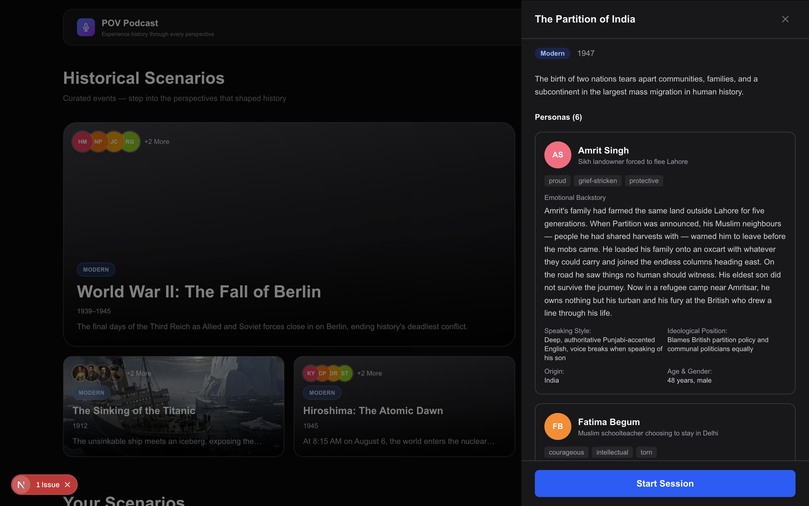
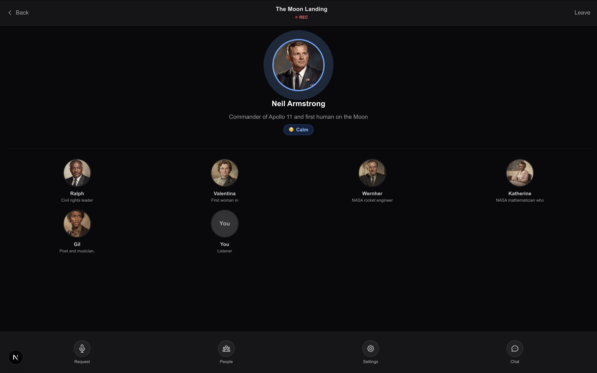

# POV Podcast

> *"The true weight of history isn't in the facts. It's in the perspectives — and for the first time, you can step inside them."*

For centuries we've learned history the same way — one narrator, one timeline, one version of the truth. **POV Podcast** changes that: step into any moment and you're *in the room*, listening to the people who lived it argue in their own voices, in real time. It's history the way it actually happened — emotional, human, and told from every side at once.

Live at **[pov-podcast.vercel.app](https://pov-podcast-ibcpvgrix-jashwanth0712s-projects.vercel.app)** · Built for **#ElevenHacks** with **@elevenlabsio** and **@kirodotdev**.

---

## What we built

**1. Pick a moment in history.** Browse curated scenarios — the Partition of India, Hiroshima, the Fall of Berlin, the Titanic — each with a cast of fully fleshed personas carrying their own emotional backstory, ideology, accent, and grief.



**2. Step into the room.** You're placed at the table alongside the people who lived it — Armstrong on Apollo 11, Katherine Johnson running the numbers, Wernher von Braun watching his rockets fly. Hit *Request* to raise your hand. The room turns and answers you, in voice, in character.



- **Multi-perspective AI personas** — each historical figure is a distinct agent with their own memory, worldview, and emotional state.
- **Live voice + live interruption** — listen like a podcast, or hit the mic and talk back. They hear you, and the conversation bends around you.
- **Sourced, not hallucinated** — every claim links to a real citation you can tap.
- **Ambient-scored** — per-scenario background music and per-persona environmental sound effects pull you inside the moment.
- **Ships with dozens of scenarios** and a generator for any new one you want to step into.

---

## How we used ElevenLabs

ElevenLabs isn't an accent on this project — it's the entire sensory layer. Every sound you hear in a session is ElevenLabs.

```
  ┌─────────────────────────────────────────────────────────┐
  │                   ElevenLabs stack                      │
  ├─────────────────────────────────────────────────────────┤
  │                                                         │
  │   🗣️  TTS (streaming)   ──▶  per-persona voices         │
  │       convex/synthesiseSpeech.ts                        │
  │       convex/voiceMatching.ts                           │
  │                                                         │
  │   🎙️  STT                ──▶  user interruptions        │
  │       convex/transcribeSpeech.ts                        │
  │                                                         │
  │   🎼  Music API          ──▶  scenario background score │
  │       convex/generateBackgroundMusic.ts                 │
  │                                                         │
  │   🔊  Sound Effects API  ──▶  persona environments      │
  │       convex/generateCharacterSoundEffect.ts            │
  │                                                         │
  └─────────────────────────────────────────────────────────┘
                          │
                          ▼
                  ┌────────────────┐
                  │  AmbientEngine │  on-device mixer
                  │  (Web Audio)   │  with auto-ducking
                  └────────────────┘
```

| Layer | Where it lives | What it does |
|---|---|---|
| **Streaming TTS** | `convex/synthesiseSpeech.ts` · `convex/voiceMatching.ts` · `src/lib/voiceEngine.ts` | Each persona gets a matched ElevenLabs voice. Turns stream into a Web Audio engine for gapless playback. |
| **STT** | `convex/transcribeSpeech.ts` | Captures user interruptions via the mic, routes them into the persona orchestrator as a real turn — not a text reply. |
| **Music API** | `convex/generateBackgroundMusic.ts` | Generates a scenario-specific ambient score from the era + emotional tone profile. Cached per scenario. |
| **Sound Effects API** | `convex/generateCharacterSoundEffect.ts` | Generates a short environmental loop per persona (artillery behind a soldier, mission-control chatter behind a flight director). |
| **Client mixer** | `src/lib/ambientEngine.ts` · `src/components/session/AmbientAudioControls.tsx` | Three layers (speech / music / SFX) mix on-device with automatic ducking, independent gain, and fades so atmosphere never fights the voice. |

```
    Speech    ▓▓▓▓▓▓▓▓▓▓▓▓▓▓▓▓▓▓▓▓▓▓▓▓▓▓    ◀── full volume
    Music     ░░▒▒░░░░░░░▒▒▒▒░░░░░░▒▒▒░     ◀── auto-ducked
    SFX       ▒░░▒░░▒░░░▒▒░░▒░░░▒░░░▒░      ◀── persona-specific
```

---

## How Kiro powered this

We ran Kiro in **spec-driven mode** end-to-end. The result: a week's hackathon shipping the kind of multi-agent system that usually takes a month.

```
   .kiro/specs/
   ├── pov-podcast/                   ◀── the core platform
   │   ├── requirements.md   (545 lines)
   │   ├── design.md         (911 lines)
   │   ├── tasks.md          (395 lines)
   │   ├── convex-patterns.md
   │   ├── openrouter-api.md
   │   └── runpod-api.md
   │
   └── elevenlabs-ambient-audio/      ◀── the music + SFX system
       ├── requirements.md
       ├── design.md
       └── tasks.md
```

**Spec-driven (the biggest multiplier).** Every major subsystem — persona orchestration, the interruption pipeline, voice matching, ambient audio — was specced first and handed to Kiro task-by-task. The spec became the contract; Kiro kept the codebase internally consistent across 30+ Convex functions and a multi-layer audio engine. The turn orchestrator (`orchestrateTurn`, `generatePersonaTurn`, `compactPersonaContext`) came out in one coherent pass — streaming, context compaction, and moderation gating all aligned to the design doc.

**Steering docs** that actually moved the needle:

1. *"This is NOT the Next.js you know — read the bundled docs before writing code."* — killed an entire class of outdated-API hallucinations on Next.js 16.
2. *"Always read `convex/_generated/ai/guidelines.md` first — it overrides training data."* — killed Convex anti-patterns around actions vs. mutations and the `"use node"` directive.
3. The spec folders themselves acted as project-scoped steering — Kiro treated `design.md` as ground truth for architectural decisions.

**Kiro powers & MCP.** The bundled Convex powers (`convex-setup-auth`, `convex-create-component`, `convex-performance-audit`) caught a read-amplification pattern on our ambient-audio subscription queries before it hit production. The Convex MCP server let Kiro introspect our live deployment — schema, functions, queries — compressing a 45-minute debug on stale subscription caches into 90 seconds.

**Vibe coding where it was right.** For UI polish, loading skeletons, mobile responsiveness, and one-shot mutations, we went full vibe mode — short back-and-forth, small diffs. Spec-first for architecture, vibe for polish. That division of labor is the whole trick.

---

## Tech stack

- **Frontend** — Next.js 16, React, Tailwind, Web Audio API
- **Backend** — Convex (real-time DB + auth + serverless actions)
- **Voice & audio** — ElevenLabs (TTS · STT · Music · Sound Effects)
- **LLM** — OpenRouter (multi-model routing)
- **Images** — Flux 2 Pro via OpenRouter (avatars + banners + cover art)
- **Developed with** — Kiro (spec-driven mode)

---

## Running it locally

```bash
npm install
npx convex dev   # in one terminal — starts the backend
npm run dev      # in another — starts Next.js at localhost:3000
```

Set the following Convex env vars (`npx convex env set KEY value`):

- `ELEVENLABS_API_KEY`
- `OPENROUTER_API_KEY`

---

## Links

- **Live demo** — [pov-podcast.vercel.app](https://pov-podcast-ibcpvgrix-jashwanth0712s-projects.vercel.app)
- **Repo** — [github.com/jashwanth0712/pov_podcast](https://github.com/jashwanth0712/pov_podcast)
- **#ElevenHacks** · **#CodeWithKiro**

> History wasn't written by one voice. It shouldn't be heard in one either.
